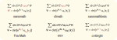

# Comparing different ways for sans-serif math with LaTeX

For details see [this blog post](https://allanchain.github.io/blog/post/sans-math-compare).

## Results

## Conclusion

Just use sansmathfonts, it's simple and nice.
